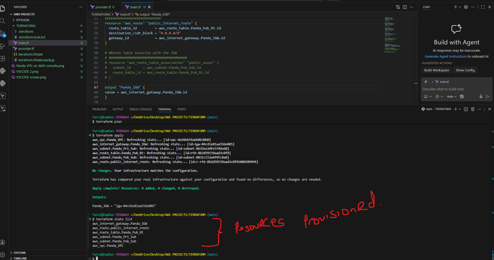

# Terraform-Based-AWS-Network-Infrastructure-Public-Private-Subnets-NAT-IGW-
Design and Deployment of a Highly Available AWS VPC Using Terraform

Provisioned AWS infrastructure using Terraform, including a custom VPC with
public and private subnets, an Internet Gateway, and route tables configured 
to enable controlled internet access for public subnets.

AWS Resources created using Terraform: 

1. VPC   :   Panda_VPC.
   
  2.Subnets: Panda_Pri_Sub.
           Panda_Pub_Sun.
             
  3.Route Table : Panda_Public-Route-table.

  4.Internet Gateway:Panda_IGW
